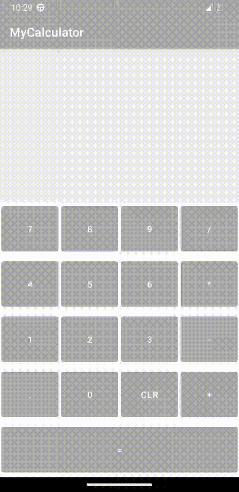

# Calculator

Second project coded on "Complete Android 12 & Kotlin Development Masterclass"

I learned how to:

- create functions to handle specific behaviors
- use `weight` property on `LinearLayout` to expand views properly
- organize strings and colors at `values` folder

## 💻 Technologies

This repo is based in:

- [Kotlin](https://kotlinlang.org/)

## 🚀 Getting Started

- Clone this repository and run on Android Studio

P.S.: You can see what I've done through each step using `git checkout <commit-hash>`

## 🧐 Result

